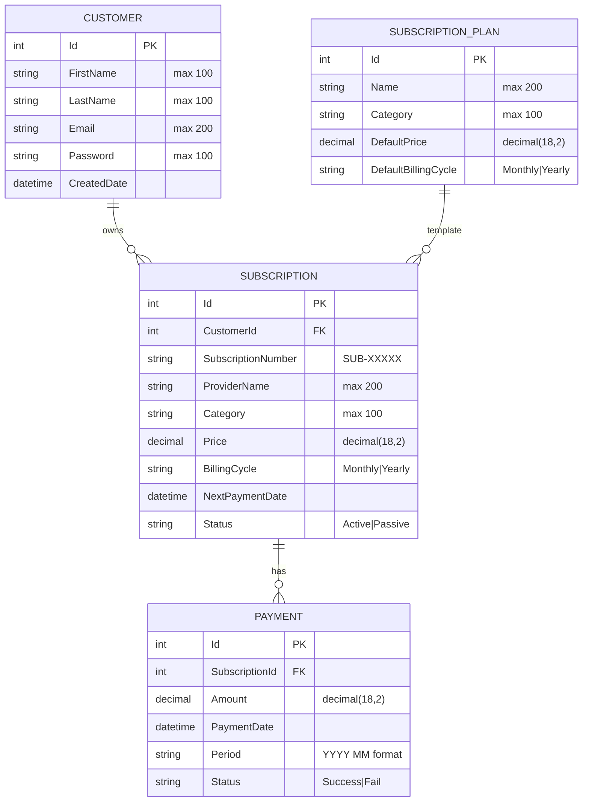
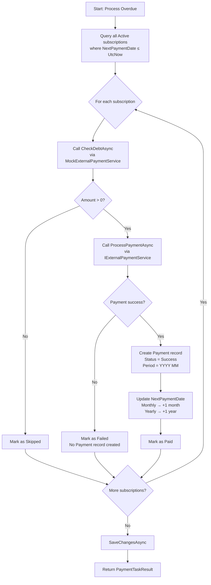
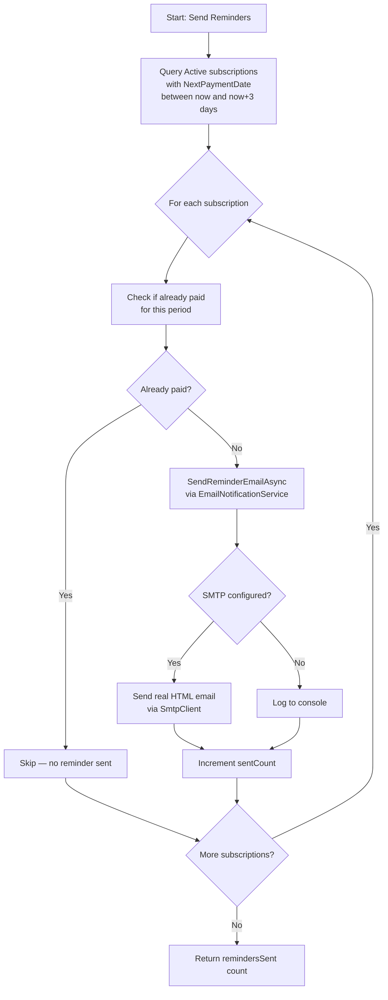
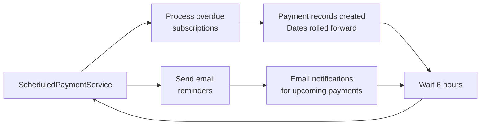

# HalalBank — System Design Document

> Subscription & Auto-Payment Reminder System  
> Version 1.0 — May 2026

---

## Table of Contents

1. [Entity-Relationship Diagram](#1-entity-relationship-diagram)
2. [API Endpoint Reference](#2-api-endpoint-reference)
3. [Flow Diagram: Debt → Payment → Reminder](#3-flow-diagram)
4. [Architecture Overview](#4-architecture-overview)

---

## 1. Entity-Relationship Diagram



### Key Relationships

| Relation | Type | Description |
|----------|------|-------------|
| Customer → Subscription | 1 : N | One customer can own multiple subscriptions |
| Subscription → Payment | 1 : N | One subscription has multiple payment records (one per period) |
| SubscriptionPlan → Subscription | 1 : N | A plan can be subscribed by many customers (optional template) |

### Cascade Rules

- Deleting a **Customer** → cascades to delete all their **Subscriptions**
- Deleting a **Subscription** → cascades to delete all its **Payments**

---

## 2. API Endpoint Reference

### 2.1 Authentication

| Method | Endpoint | Description | Auth | Request Body | Response |
|--------|----------|-------------|------|-------------|----------|
| `POST` | `/api/auth/login` | Authenticate user | — | `{ email, password }` | `{ id, email, firstName, lastName, role }` |
| `POST` | `/api/auth/register` | Create new account | — | `{ firstName, lastName, email, password }` | `{ id, email, firstName, lastName, role }` |

### 2.2 Customers

| Method | Endpoint | Description | Request Body | Response |
|--------|----------|-------------|-------------|----------|
| `GET` | `/api/customers` | List all customers | — | `CustomerDto[]` |
| `GET` | `/api/customers/{id}` | Get customer by ID | — | `CustomerDto` |
| `POST` | `/api/customers` | Create customer | `CreateCustomerDto` | `CustomerDto` (201) |
| `DELETE` | `/api/customers/{id}` | Delete customer | — | 204 No Content |

### 2.3 Subscriptions

| Method | Endpoint | Description | Request Body | Response |
|--------|----------|-------------|-------------|----------|
| `GET` | `/api/subscriptions` | List all subscriptions | — | `SubscriptionDto[]` |
| `GET` | `/api/subscriptions/{id}` | Get by ID | — | `SubscriptionDto` |
| `GET` | `/api/subscriptions/by-customer/{customerId}` | Get by customer | — | `SubscriptionDto[]` |
| `POST` | `/api/subscriptions` | Create subscription | `CreateSubscriptionDto` | `SubscriptionDto` (201) |
| `PUT` | `/api/subscriptions/{id}` | Update subscription | `UpdateSubscriptionDto` | 204 No Content |
| `DELETE` | `/api/subscriptions/{id}` | Delete subscription | — | 204 No Content |

#### Subscription DTOs

**CreateSubscriptionDto:**
```json
{
  "customerId": 1,
  "subscriptionNumber": "",           // auto-generated if empty
  "providerName": "Netflix",
  "category": "Streaming",
  "price": 15.99,
  "billingCycle": "Monthly",
  "nextPaymentDate": "2026-06-15T00:00:00Z"
}
```

**UpdateSubscriptionDto** (all fields optional):
```json
{
  "price": 19.99,
  "status": "Passive"
}
```

### 2.4 Payments

| Method | Endpoint | Description | Request Body | Response |
|--------|----------|-------------|-------------|----------|
| `GET` | `/api/payments` | List all payments | — | `PaymentDto[]` |
| `GET` | `/api/payments/{id}` | Get by ID | — | `PaymentDto` |
| `GET` | `/api/payments/by-subscription/{subscriptionId}` | Get by subscription | — | `PaymentDto[]` |
| `POST` | `/api/payments/query-debt/{subscriptionId}` | Query debt for period | — | `DebtResponseDto` |
| `POST` | `/api/payments/pay` | Process payment | `CreatePaymentDto` | `PaymentDto` (201) |

#### Payment DTOs

**DebtResponseDto:**
```json
{
  "amount": 15.99,            // 0 if already paid
  "dueDate": "2026-06-01T...",
  "period": "2026 05"        // YYYY MM format
}
```

**CreatePaymentDto:**
```json
{
  "subscriptionId": 1,
  "amount": 15.99
}
```

### 2.5 Subscription Plans (Service Catalog)

| Method | Endpoint | Description | Request Body | Response |
|--------|----------|-------------|-------------|----------|
| `GET` | `/api/subscriptionplans` | List all plans | — | `SubscriptionPlanDto[]` |
| `GET` | `/api/subscriptionplans/{id}` | Get by ID | — | `SubscriptionPlanDto` |
| `POST` | `/api/subscriptionplans` | Create plan | `CreateSubscriptionPlanDto` | `SubscriptionPlanDto` (201) |
| `PUT` | `/api/subscriptionplans/{id}` | Update plan | `UpdateSubscriptionPlanDto` | 204 No Content |
| `DELETE` | `/api/subscriptionplans/{id}` | Delete plan | — | 204 No Content |

### 2.6 Dashboard & Tasks

| Method | Endpoint | Description | Response |
|--------|----------|-------------|----------|
| `GET` | `/api/dashboard` | Dashboard stats (active count + upcoming 7d) | `DashboardDto` |
| `POST` | `/api/payment-task/process-overdue` | Process all overdue subscriptions | `PaymentTaskResult` |
| `POST` | `/api/payment-task/send-reminders` | Send email reminders (due within 3 days) | `{ remindersSent: number }` |

#### PaymentTaskResult

```json
{
  "checkedCount": 5,
  "paidCount": 3,
  "failedCount": 1,
  "skippedCount": 1,
  "details": [
    "Subscription 1 (Netflix): Paid $15.99. Next payment: 01 Jul 2026",
    "Subscription 2 (Spotify): No debt. Skipped.",
    "Subscription 3 (Electricity Bill): Payment failed.",
    "..."
  ]
}
```

### 2.7 Error Handling

All endpoints return consistent error responses via `ExceptionHandlingMiddleware`:

| HTTP Status | Condition |
|-------------|-----------|
| `400 Bad Request` | Invalid operation (e.g., double payment) |
| `404 Not Found` | Resource not found (invalid ID) |
| `500 Internal Server Error` | Unexpected exception |

```json
{
  "error": "Subscription with id 999 not found."
}
```

---

## 3. Flow Diagram

### 3.1 Overdue Payment Processing



### 3.2 Email Reminder Flow



### 3.3 User Payment Flow (Frontend)

```mermaid
flowchart TD
    A[User clicks Pay on subscription] --> B[Navigate to<br/>/payment-gateway/{id}]
    B --> C[POST /api/payments/query-debt]
    C --> D{Already paid for period?}
    D -->|Yes| E[Show "Already Paid" badge<br/>Auto-redirect in 5s<br/>or click "Go to Dashboard"]
    D -->|No| F[Show Amount Due, Due Date, Period]
    F --> G[User clicks Confirm Payment]
    G --> H[2s processing spinner]
    H --> I[POST /api/payments/pay]
    I --> J{Success?}
    J -->|Yes| K[Redirect to Dashboard<br/>with success toast]
    J -->|No| L[Show error message<br/>"Payment declined"]
```

### 3.4 Scheduled Background Service (Runs Every 6 Hours)



---

## 4. Architecture Overview

### 4.1 Clean Architecture Layers

```
┌─────────────────────────────────────────────────┐
│                    API Layer                      │
│  Controllers · Middleware · Program.cs            │
│  (HTTP interface, DI registration, CORS, Swagger) │
├─────────────────────────────────────────────────┤
│                Infrastructure Layer               │
│  EF Core DbContext · Repositories                 │
│  External Services (MockBank, Email, Payment)     │
│  ScheduledPaymentService (BackgroundService)      │
├─────────────────────────────────────────────────┤
│                Application Layer                  │
│  DTOs · Service Interfaces · Service Implementations│
│  Mapping Profiles · Business Logic                 │
├─────────────────────────────────────────────────┤
│                  Domain Layer                     │
│  Entities (Customer, Subscription, Payment, Plan) │
│  Enums · Repository Interfaces (IUnitOfWork)      │
└─────────────────────────────────────────────────┘
```

### 4.2 Dependency Injection Registration

| Interface | Implementation | Lifetime |
|-----------|---------------|----------|
| `IUnitOfWork` | `UnitOfWork` | Scoped |
| `ICustomerService` | `CustomerService` | Scoped |
| `ISubscriptionService` | `SubscriptionService` | Scoped |
| `IPaymentService` | `PaymentService` | Scoped |
| `IPaymentTaskService` | `PaymentTaskService` | Scoped |
| `ISubscriptionPlanService` | `SubscriptionPlanService` | Scoped |
| `IAuthService` | `AuthService` | Scoped |
| `IPaymentGateway` | `MockPaymentGateway` | Scoped |
| `IExternalPaymentService` | `MockExternalPaymentService` | Scoped |
| `INotificationService` | `EmailNotificationService` | Scoped |
| `IHttpClientFactory` | `"MockBankApi"` named client | Singleton |
| `ScheduledPaymentService` | (BackgroundService) | Singleton Hosted |

### 4.3 External Services (Mock)

| Service | Type | Behavior |
|---------|------|----------|
| **MockBankMessageHandler** | HTTP handler | 1s delay on all calls; `/debt/*` returns subscription price; `/payment/*` = 80% success / 20% fail |
| **MockPaymentGateway** | Direct mock | Returns `success: true` if amount > 0 |
| **EmailNotificationService** | SMTP client | Real email via configurable SMTP; falls back to console log if unconfigured |

### 4.4 Technology Stack

| Layer | Technology |
|-------|-----------|
| Backend | C# · .NET 8 · Clean Architecture |
| Frontend | React 18 · TypeScript · Vite 6 · Tailwind CSS v4 |
| Database | MS SQL Server (LocalDB) · EF Core 8 |
| Testing | xUnit · Moq · FluentAssertions · Vitest |
| CI/CD | GitHub Actions (ubuntu-latest) |

---

*Document generated for HalalBank case study — May 2026*
