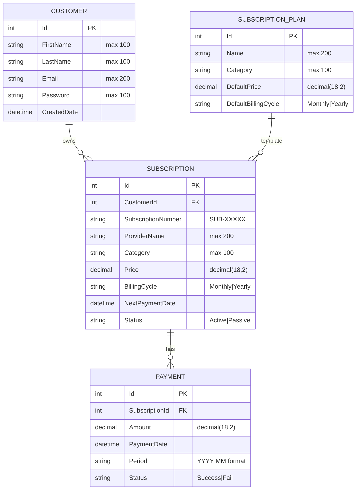
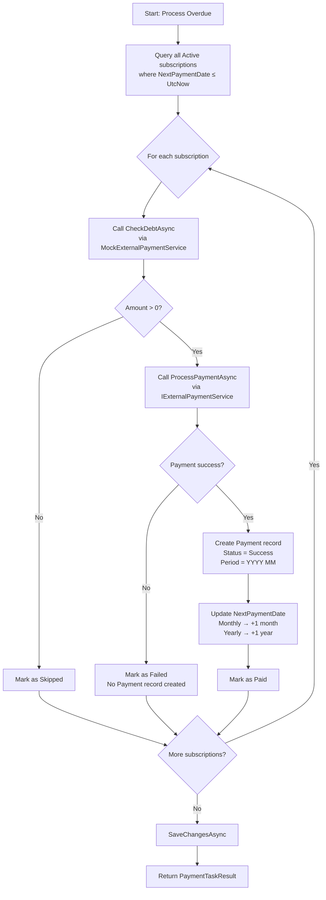
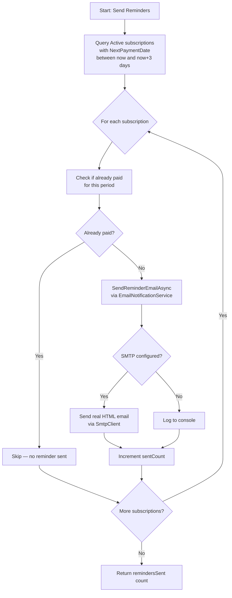
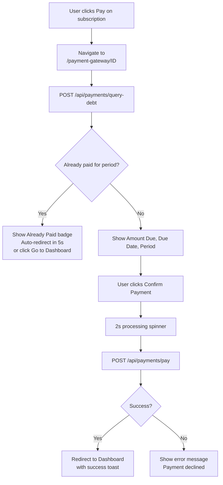
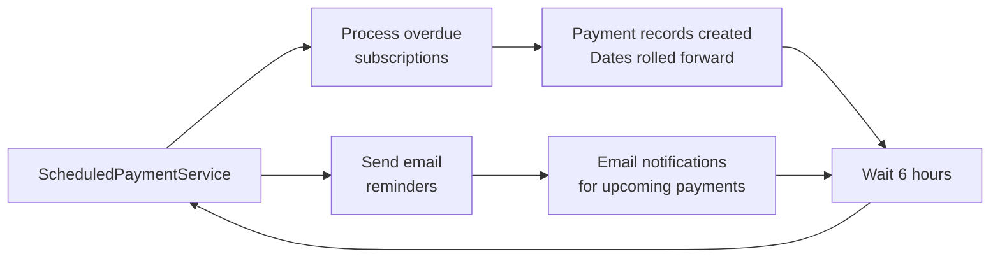

# HalalBank — System Design Document

> Subscription & Auto-Payment Reminder System  
> Version 1.0 — May 2026

---

## Table of Contents

1. [Entity-Relationship Diagram](#1-entity-relationship-diagram)
2. [API Endpoint Reference](#2-api-endpoint-reference)
3. [Flow Diagram: Debt → Payment → Reminder](#3-flow-diagram)
4. [Architecture Overview](#4-architecture-overview)

---

## 1. Entity-Relationship Diagram



### Key Relationships

| Relation | Type | Description |
|----------|------|-------------|
| Customer → Subscription | 1 : N | One customer can own multiple subscriptions |
| Subscription → Payment | 1 : N | One subscription has multiple payment records (one per period) |
| SubscriptionPlan → Subscription | 1 : N | A plan can be subscribed by many customers (optional template) |

### Cascade Rules

- Deleting a **Customer** → cascades to delete all their **Subscriptions**
- Deleting a **Subscription** → cascades to delete all its **Payments**

---

## 2. API Endpoint Reference

### 2.1 Authentication

| Method | Endpoint | Description | Auth | Request Body | Response |
|--------|----------|-------------|------|-------------|----------|
| `POST` | `/api/auth/login` | Authenticate user | — | `{ email, password }` | `{ id, email, firstName, lastName, role }` |
| `POST` | `/api/auth/register` | Create new account | — | `{ firstName, lastName, email, password }` | `{ id, email, firstName, lastName, role }` |

### 2.2 Customers

| Method | Endpoint | Description | Request Body | Response |
|--------|----------|-------------|-------------|----------|
| `GET` | `/api/customers` | List all customers | — | `CustomerDto[]` |
| `GET` | `/api/customers/{id}` | Get customer by ID | — | `CustomerDto` |
| `POST` | `/api/customers` | Create customer | `CreateCustomerDto` | `CustomerDto` (201) |
| `DELETE` | `/api/customers/{id}` | Delete customer | — | 204 No Content |

### 2.3 Subscriptions

| Method | Endpoint | Description | Request Body | Response |
|--------|----------|-------------|-------------|----------|
| `GET` | `/api/subscriptions` | List all subscriptions | — | `SubscriptionDto[]` |
| `GET` | `/api/subscriptions/{id}` | Get by ID | — | `SubscriptionDto` |
| `GET` | `/api/subscriptions/by-customer/{customerId}` | Get by customer | — | `SubscriptionDto[]` |
| `POST` | `/api/subscriptions` | Create subscription | `CreateSubscriptionDto` | `SubscriptionDto` (201) |
| `PUT` | `/api/subscriptions/{id}` | Update subscription | `UpdateSubscriptionDto` | 204 No Content |
| `DELETE` | `/api/subscriptions/{id}` | Delete subscription | — | 204 No Content |

#### Subscription DTOs

**CreateSubscriptionDto:**
```json
{
  "customerId": 1,
  "subscriptionNumber": "",           // auto-generated if empty
  "providerName": "Netflix",
  "category": "Streaming",
  "price": 15.99,
  "billingCycle": "Monthly",
  "nextPaymentDate": "2026-06-15T00:00:00Z"
}
```

**UpdateSubscriptionDto** (all fields optional):
```json
{
  "price": 19.99,
  "status": "Passive"
}
```

### 2.4 Payments

| Method | Endpoint | Description | Request Body | Response |
|--------|----------|-------------|-------------|----------|
| `GET` | `/api/payments` | List all payments | — | `PaymentDto[]` |
| `GET` | `/api/payments/{id}` | Get by ID | — | `PaymentDto` |
| `GET` | `/api/payments/by-subscription/{subscriptionId}` | Get by subscription | — | `PaymentDto[]` |
| `POST` | `/api/payments/query-debt/{subscriptionId}` | Query debt for period | — | `DebtResponseDto` |
| `POST` | `/api/payments/pay` | Process payment | `CreatePaymentDto` | `PaymentDto` (201) |

#### Payment DTOs

**DebtResponseDto:**
```json
{
  "amount": 15.99,            // 0 if already paid
  "dueDate": "2026-06-01T...",
  "period": "2026 05"        // YYYY MM format
}
```

**CreatePaymentDto:**
```json
{
  "subscriptionId": 1,
  "amount": 15.99
}
```

### 2.5 Subscription Plans (Service Catalog)

| Method | Endpoint | Description | Request Body | Response |
|--------|----------|-------------|-------------|----------|
| `GET` | `/api/subscriptionplans` | List all plans | — | `SubscriptionPlanDto[]` |
| `GET` | `/api/subscriptionplans/{id}` | Get by ID | — | `SubscriptionPlanDto` |
| `POST` | `/api/subscriptionplans` | Create plan | `CreateSubscriptionPlanDto` | `SubscriptionPlanDto` (201) |
| `PUT` | `/api/subscriptionplans/{id}` | Update plan | `UpdateSubscriptionPlanDto` | 204 No Content |
| `DELETE` | `/api/subscriptionplans/{id}` | Delete plan | — | 204 No Content |

### 2.6 Dashboard & Tasks

| Method | Endpoint | Description | Response |
|--------|----------|-------------|----------|
| `GET` | `/api/dashboard` | Dashboard stats (active count + upcoming 7d) | `DashboardDto` |
| `POST` | `/api/payment-task/process-overdue` | Process all overdue subscriptions | `PaymentTaskResult` |
| `POST` | `/api/payment-task/send-reminders` | Send email reminders (due within 3 days) | `{ remindersSent: number }` |

#### PaymentTaskResult

```json
{
  "checkedCount": 5,
  "paidCount": 3,
  "failedCount": 1,
  "skippedCount": 1,
  "details": [
    "Subscription 1 (Netflix): Paid $15.99. Next payment: 01 Jul 2026",
    "Subscription 2 (Spotify): No debt. Skipped.",
    "Subscription 3 (Electricity Bill): Payment failed.",
    "..."
  ]
}
```

### 2.7 Error Handling

All endpoints return consistent error responses via `ExceptionHandlingMiddleware`:

| HTTP Status | Condition |
|-------------|-----------|
| `400 Bad Request` | Invalid operation (e.g., double payment) |
| `404 Not Found` | Resource not found (invalid ID) |
| `500 Internal Server Error` | Unexpected exception |

```json
{
  "error": "Subscription with id 999 not found."
}
```

---

## 3. Flow Diagram

### 3.1 Overdue Payment Processing



### 3.2 Email Reminder Flow



### 3.3 User Payment Flow (Frontend)



### 3.4 Scheduled Background Service (Runs Every 6 Hours)



---

## 4. Architecture Overview

### 4.1 Architecture Type: Monolithic Two-Tier with Clean Architecture

```
┌─────────────────────────────────────────────────────────────────────┐
│                        CLIENT LAYER (Tier 1)                        │
│                                                                     │
│   ┌───────────────────────────────────────────────────────────┐     │
│   │              React SPA (Single Page Application)            │     │
│   │  Browser-side routing (react-router-dom)                   │     │
│   │  State management via React Context (AuthContext)          │     │
│   │  HTTP communication via fetch API (api.ts service layer)   │     │
│   │  CSS framework: Tailwind CSS v4                            │     │
│   └──────────────────────┬────────────────────────────────────┘     │
│                          │ HTTP / JSON                              │
│                          │ localhost:3000 → proxy → localhost:5000  │
└──────────────────────────┼──────────────────────────────────────────┘
                           │
┌──────────────────────────┼──────────────────────────────────────────┐
│                   SERVER LAYER (Tier 2)                              │
│                                                                     │
│   ┌───────────────────────────────────────────────────────────┐     │
│   │              .NET 8 Web API (Monolith)                     │     │
│   │                                                             │     │
│   │  ┌─────────────────────────────────────────────────────┐  │     │
│   │  │            PRESENTATION (API Layer)                  │  │     │
│   │  │  Controllers · Middleware · Program.cs               │  │     │
│   │  │  CORS · Swagger · DI Container                      │  │     │
│   │  └────────────────┬────────────────────────────────────┘  │     │
│   │                   │                                       │     │
│   │  ┌────────────────┴────────────────────────────────────┐  │     │
│   │  │            INFRASTRUCTURE LAYER                      │  │     │
│   │  │  EF Core DbContext · Repositories (EF)              │  │     │
│   │  │  External Services (Mock Payment, Email, HTTP)      │  │     │
│   │  │  ScheduledPaymentService (BackgroundService)         │  │     │
│   │  └────────────────┬────────────────────────────────────┘  │     │
│   │                   │                                       │     │
│   │  ┌────────────────┴────────────────────────────────────┐  │     │
│   │  │            APPLICATION LAYER                         │  │     │
│   │  │  DTOs · Service Interfaces · Business Logic         │  │     │
│   │  │  Mapping Profiles · PaymentTaskService · AuthService│  │     │
│   │  └────────────────┬────────────────────────────────────┘  │     │
│   │                   │                                       │     │
│   │  ┌────────────────┴────────────────────────────────────┐  │     │
│   │  │            DOMAIN LAYER                              │  │     │
│   │  │  Entities · Enums · Repository Interfaces            │  │     │
│   │  │  IUnitOfWork (no external dependencies)              │  │     │
│   │  └─────────────────────────────────────────────────────┘  │     │
│   └───────────────────────────────────────────────────────────┘     │
│                                                                     │
│   ┌───────────────────────────────────────────────────────────┐     │
│   │              DATABASE (MS SQL Server LocalDB)              │     │
│   │  Tables: Customers, Subscriptions, Payments,              │     │
│   │          SubscriptionPlans, __EFMigrationsHistory         │     │
│   └───────────────────────────────────────────────────────────┘     │
└─────────────────────────────────────────────────────────────────────┘
```

#### Important Architectural Decisions

| Decision | Choice | Rationale |
|----------|--------|-----------|
| **Architecture Style** | Monolithic (not microservice) | **Having many API endpoints (payments, subscriptions, customers, auth, plans) does NOT make this a microservice architecture.** This is a common misunderstanding. A monolith means the entire backend runs as **a single process, a single deployable artifact, sharing one database**. All controllers (`PaymentsController`, `SubscriptionsController`, etc.) live in the same codebase, are compiled into one DLL, and run on one port (`:5000`). In a microservice architecture, each of these would be a separate service with its own process, its own database, its own deployment pipeline, communicating via network calls (HTTP/message queue). This project is a monolith with Clean Architecture — the layers are logical/organizational separations within the same process, not physical/deployment separations. Rationale: focused domain scope, no need for distributed transaction complexity, easy to deploy, debug, and test. |
| **Deployment Topology** | Two-tier (Client + Server) | Frontend and backend are separate processes communicating via HTTP/JSON. The frontend Vite dev server proxies `/api` requests to the .NET backend. In production, they would be deployed as separate artifacts (static files served via CDN + backend behind a reverse proxy). |
| **Not a Single-Page Application in the traditional sense** | Multi-route SPA | While the frontend uses React SPA architecture (client-side routing via `react-router-dom`), it has multiple distinct pages (`/login`, `/dashboard`, `/discover`, `/admin`, `/payment-gateway/:id`) rather than being a true "single page" infinite scroll app. Each route corresponds to a dedicated view with its own data fetching and state. |
| **Frontend-Backend Communication** | REST over HTTP | Stateless, cacheable, uniform interface. The frontend `api.ts` service layer wraps all `fetch` calls. No real-time websocket or gRPC needed. |
| **Authentication** | Mock + Real Backend Auth | Login uses `POST /api/auth/login` which validates credentials against the database. Admin (`admin@test.com`/`admin123`) is handled via frontend mock for simplicity. Passwords stored as plaintext (case study constraint — real app would use hashing). |
| **Background Processing** | In-process Hosted Service | `ScheduledPaymentService` runs inside the same ASP.NET process as a `BackgroundService`. No external job scheduler (Hangfire, Quartz) needed. Runs every 6 hours. For a production system, this would be extracted to a separate worker or function. |
| **Database** | LocalDB (Developer) | SQL Server LocalDB for development. The connection string in `appsettings.json` can be swapped to a full SQL Server instance for staging/production. EF Core migrations handle schema versioning. |

### 4.2 Communication Patterns

```
┌──────────┐         HTTP REST (JSON)         ┌────────────┐
│  React   │ ──────────────────────────────►   │  .NET API  │
│  Client  │                                   │  Backend   │
│:3000     │ ◄──────────────────────────────   │:5000       │
└──────────┘         JSON Responses            └─────┬──────┘
                                                      │
                                  ┌───────────────────┼───────────────────┐
                                  │                   │                   │
                                  ▼                   ▼                   ▼
                          ┌──────────────┐   ┌──────────────┐   ┌──────────────┐
                          │   SQL Server  │   │ Mock Payment │   │  SMTP Email  │
                          │   (LocalDB)   │   │   Gateway    │   │   (Gmail)    │
                          └──────────────┘   └──────────────┘   └──────────────┘
```

- **Frontend ↔ Backend:** Synchronous REST calls (request → response)
- **Backend ↔ Database:** Entity Framework Core (ORM, connection pooling)
- **Backend ↔ External Services:** `IHttpClientFactory` with named client `"MockBankApi"` (mock HTTP handler)
- **Backend → Email:** `SmtpClient` (synchronous send within request or background task)
- **Background Service:** Uses DI scope factory to resolve services independently of HTTP requests

### 4.3 Route Map

| Frontend Route | Page Component | Access | API Endpoints Used |
|---------------|----------------|--------|-------------------|
| `/` | Redirect → `/login` | Public | — |
| `/login` | `Login.tsx` | Public | `POST /api/auth/login` |
| `/register` | `Register.tsx` | Public | `POST /api/auth/register` |
| `/dashboard` | `Dashboard.tsx` | Any authenticated user | `GET /api/subscriptions/by-customer/{id}` |
| `/discover` | `Discover.tsx` | Any authenticated user | `GET /api/subscriptionplans` · `POST /api/subscriptions` · `DELETE /api/subscriptionplans/{id}` |
| `/admin` | `Admin.tsx` | Admin only | `GET /api/subscriptions` · `PUT /api/subscriptions/{id}` · `DELETE /api/subscriptions/{id}` · `POST /api/payment-task/process-overdue` |
| `/payment-gateway/:subscriptionId` | `PaymentGateway.tsx` | Any authenticated user | `POST /api/payments/query-debt/{id}` · `POST /api/payments/pay` |

### 4.4 Dependency Injection Registration

| Interface | Implementation | Lifetime | Purpose |
|-----------|---------------|----------|---------|
| `IUnitOfWork` | `UnitOfWork` | Scoped (per request) | Coordinates repository access and transactions |
| `ICustomerService` | `CustomerService` | Scoped | Customer CRUD business logic |
| `ISubscriptionService` | `SubscriptionService` | Scoped | Subscription CRUD + active count + upcoming |
| `IPaymentService` | `PaymentService` | Scoped | Debt query + payment processing + double-payment prevention |
| `IPaymentTaskService` | `PaymentTaskService` | Scoped | Overdue subscription batch processing |
| `ISubscriptionPlanService` | `SubscriptionPlanService` | Scoped | Service catalog CRUD |
| `IAuthService` | `AuthService` | Scoped | Login validation + user registration |
| `IPaymentGateway` | `MockPaymentGateway` | Scoped | Direct mock: returns success if amount > 0 |
| `IExternalPaymentService` | `MockExternalPaymentService` | Scoped | HTTP-based mock using `IHttpClientFactory` |
| `INotificationService` | `EmailNotificationService` | Scoped | Real SMTP email with console fallback |
| `IHttpClientFactory` | `"MockBankApi"` client | Singleton | Named client with `MockBankMessageHandler` pipeline |
| `ScheduledPaymentService` | `BackgroundService` | Singleton | Auto-runs overdue check + reminders every 6 hours |

### 4.5 External Services (Mock)

| Service | Interface | Implementation | Behavior |
|---------|-----------|---------------|----------|
| **Debt Query** | `IExternalPaymentService.CheckDebtAsync()` | `MockBankMessageHandler` | Returns exact subscription price from URL path |
| **Payment Processing** | `IExternalPaymentService.ProcessPaymentAsync()` | `MockBankMessageHandler` | 1s simulated delay · 80% success / 20% failure |
| **Payment Gateway** | `IPaymentGateway.ProcessPaymentAsync()` | `MockPaymentGateway` | Returns `success: true` if amount > 0 (no HTTP) |
| **Email Notification** | `INotificationService.SendReminderEmailAsync()` | `EmailNotificationService` | Real SMTP via `SmtpClient` · falls back to console log if unconfigured |

### 4.6 Technology Stack

| Layer | Technology | Version | Purpose |
|-------|-----------|---------|---------|
| **Backend Runtime** | C# / .NET | 8.0 | Primary backend language and runtime |
| **Backend Framework** | ASP.NET Core Web API | 8.0 | REST API framework |
| **Architecture** | Clean Architecture | — | Separation of concerns: Domain → Application → Infrastructure → API |
| **ORM** | Entity Framework Core | 8.0 | Database access with migrations |
| **Database** | MS SQL Server (LocalDB) | — | Relational data store |
| **Frontend Runtime** | TypeScript | ~5.x | Type-safe JavaScript |
| **Frontend Framework** | React | 18.x | Component-based UI |
| **Build Tool** | Vite | 6.x | Fast dev server and bundler |
| **CSS** | Tailwind CSS | 4.x | Utility-first styling |
| **Backend Testing** | xUnit + Moq + FluentAssertions | — | Unit testing with mocking |
| **Frontend Testing** | Vitest + testing-library + happy-dom | — | Component and context testing |
| **CI/CD** | GitHub Actions | — | Automated build and test on push/PR |
| **Auth** | Mock + Backend API | — | Email/password validation via auth controller |

---

*Document generated for HalalBank case study — May 2026*
