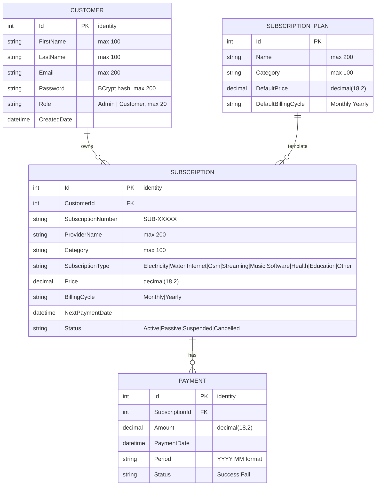
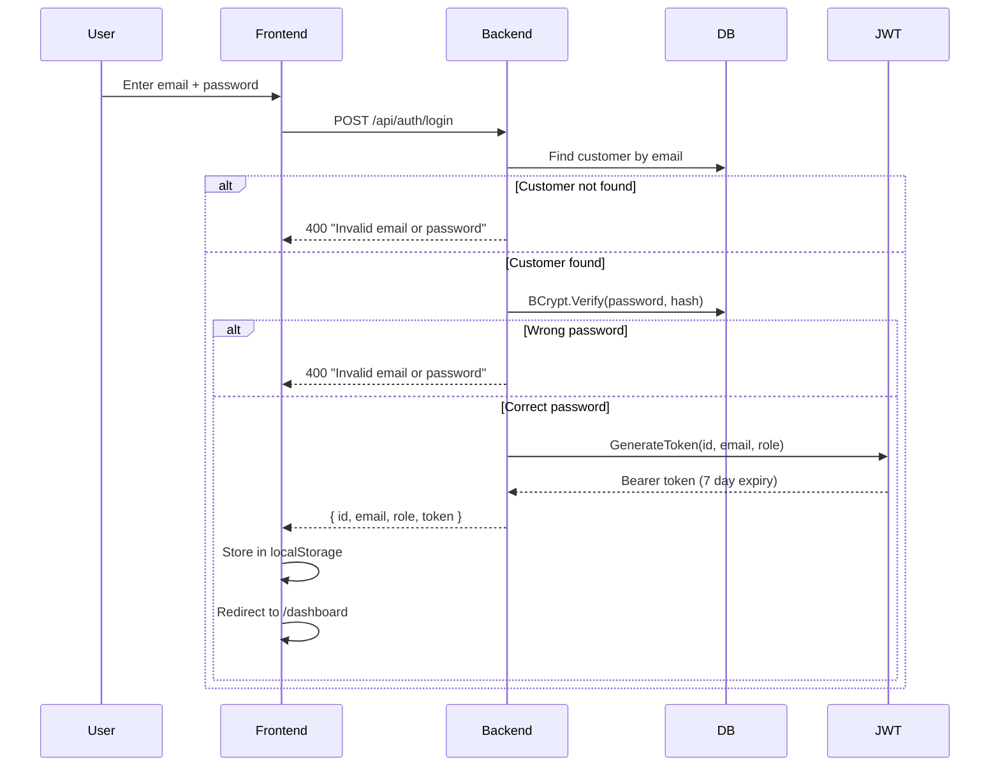
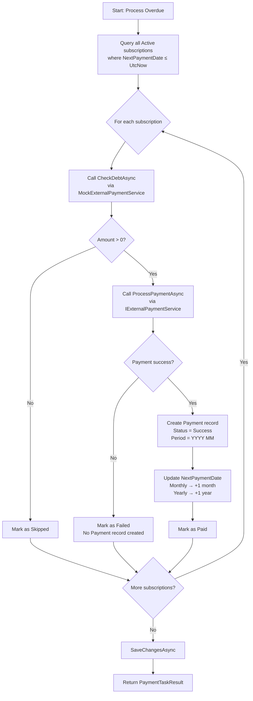
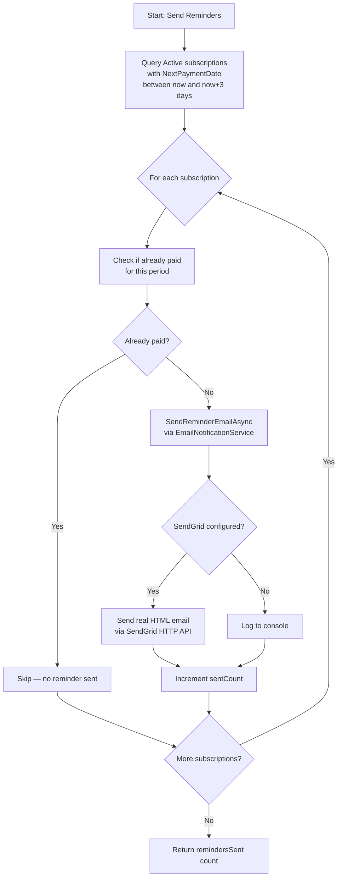
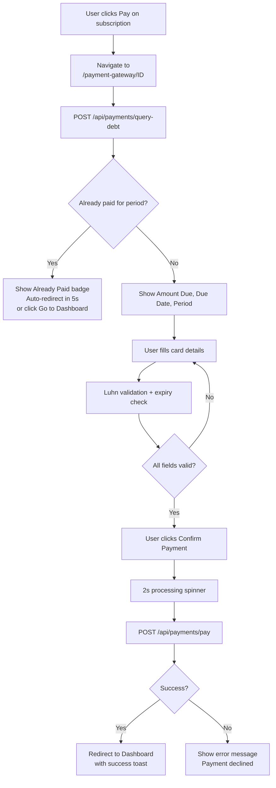
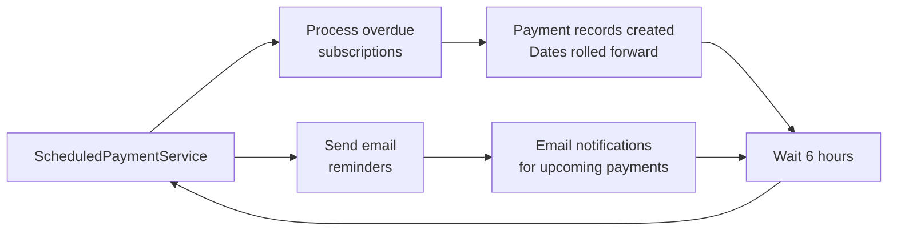

# HalalBank — System Design Document

> Subscription & Auto-Payment Reminder System  
> Version 2.0 — May 2026

---

## Table of Contents

1. [Entity-Relationship Diagram](#1-entity-relationship-diagram)
2. [API Endpoint Reference](#2-api-endpoint-reference)
3. [Flow Diagram: Debt → Payment → Reminder](#3-flow-diagram)
4. [Architecture Overview](#4-architecture-overview)

---

## 1. Entity-Relationship Diagram



### Key Relationships

| Relation | Type | Description |
|----------|------|-------------|
| Customer → Subscription | 1 : N | One customer can own multiple subscriptions |
| Subscription → Payment | 1 : N | One subscription has multiple payment records (one per period) |
| SubscriptionPlan → Subscription | 1 : N | A plan can be subscribed by many customers (optional template) |

### Cascade Rules

- Deleting a **Customer** → cascades to delete all their **Subscriptions**
- Deleting a **Subscription** → cascades to delete all its **Payments**

---

## 2. API Endpoint Reference

### 2.1 Authentication

| Method | Endpoint | Description | Auth | Request Body | Response |
|--------|----------|-------------|------|-------------|----------|
| `POST` | `/api/auth/login` | Authenticate user | — | `{ email, password }` | `{ id, email, firstName, lastName, role, token }` |
| `POST` | `/api/auth/register` | Create new account | — | `{ firstName, lastName, email, password }` | `{ id, email, firstName, lastName, role, token }` |
| `POST` | `/api/auth/google-login` | Google OAuth login | — | `{ idToken }` | `{ id, email, firstName, lastName, role, token }` |
| `POST` | `/api/auth/forgot-password` | Reset password | — | `{ email }` | `{ message }` |

### 2.2 Customers (Admin only)

| Method | Endpoint | Description | Auth | Response |
|--------|----------|-------------|------|----------|
| `GET` | `/api/customers` | List all customers | Admin | `CustomerDto[]` |
| `GET` | `/api/customers/{id}` | Get customer by ID | Admin | `CustomerDto` |
| `POST` | `/api/customers` | Create customer | Admin | `CustomerDto` (201) |
| `DELETE` | `/api/customers/{id}` | Delete customer | Admin | 204 No Content |

### 2.3 Subscriptions

| Method | Endpoint | Description | Auth | Response |
|--------|----------|-------------|------|----------|
| `GET` | `/api/subscriptions` | List all subscriptions | Admin | `SubscriptionDto[]` |
| `GET` | `/api/subscriptions/{id}` | Get by ID | Any user (own) | `SubscriptionDto` |
| `GET` | `/api/subscriptions/by-customer/{customerId}` | Get by customer | Any user (own) | `SubscriptionDto[]` |
| `POST` | `/api/subscriptions` | Create subscription | Any user | `SubscriptionDto` (201) |
| `PUT` | `/api/subscriptions/{id}` | Update subscription | Any user (own) | 204 No Content |
| `DELETE` | `/api/subscriptions/{id}` | Delete subscription | Any user (own) | 204 No Content |

### 2.4 Payments

| Method | Endpoint | Description | Auth | Response |
|--------|----------|-------------|------|----------|
| `GET` | `/api/payments` | List all payments | Admin | `PaymentDto[]` |
| `GET` | `/api/payments/{id}` | Get by ID | Any user | `PaymentDto` |
| `GET` | `/api/payments/by-subscription/{subscriptionId}` | Get by subscription | Any user | `PaymentDto[]` |
| `POST` | `/api/payments/query-debt/{subscriptionId}` | Query debt for period | Any user | `DebtResponseDto` |
| `POST` | `/api/payments/pay` | Process payment | Any user | `PaymentDto` (201) |

### 2.5 Subscription Plans (Service Catalog)

| Method | Endpoint | Description | Auth | Response |
|--------|----------|-------------|------|----------|
| `GET` | `/api/subscriptionplans` | List all plans | Any user | `SubscriptionPlanDto[]` |
| `GET` | `/api/subscriptionplans/{id}` | Get by ID | Any user | `SubscriptionPlanDto` |
| `POST` | `/api/subscriptionplans` | Create plan | Admin | `SubscriptionPlanDto` (201) |
| `PUT` | `/api/subscriptionplans/{id}` | Update plan | Admin | 204 No Content |
| `DELETE` | `/api/subscriptionplans/{id}` | Delete plan | Admin | 204 No Content |

### 2.6 Dashboard & Tasks

| Method | Endpoint | Description | Auth | Response |
|--------|----------|-------------|------|----------|
| `GET` | `/api/dashboard` | Dashboard stats (active + upcoming 7d) | Any user | `DashboardDto` |
| `POST` | `/api/payment-task/process-overdue` | Process all overdue subscriptions | Admin | `PaymentTaskResult` |
| `POST` | `/api/payment-task/send-reminders` | Send email reminders (due within 3 days) | Admin | `{ remindersSent }` |

### 2.7 Health

| Method | Endpoint | Description | Auth | Response |
|--------|----------|-------------|------|----------|
| `GET` | `/api/health` | Health check | — | `{ status, timestamp }` |

### 2.8 Error Handling

All endpoints return consistent error responses via `ExceptionHandlingMiddleware`:

| HTTP Status | Condition |
|-------------|-----------|
| `400 Bad Request` | Invalid operation (e.g., double payment, wrong password) |
| `401 Unauthorized` | Missing or invalid JWT token |
| `403 Forbidden` | Insufficient role (non-admin accessing admin endpoint) |
| `404 Not Found` | Resource not found (invalid ID) |
| `500 Internal Server Error` | Unexpected exception |

```json
{
  "error": "Subscription with id 999 not found."
}
```

---

## 3. Flow Diagram

### 3.1 Authentication Flow



### 3.2 Overdue Payment Processing



### 3.3 Email Reminder Flow



### 3.4 User Payment Flow (Frontend)



### 3.5 Scheduled Background Service (Runs Every 6 Hours)



---

## 4. Architecture Overview

### 4.1 Architecture Type: Monolithic Two-Tier with Clean Architecture

```
┌─────────────────────────────────────────────────────────────────────┐
│                        CLIENT LAYER (Tier 1)                        │
│                                                                     │
│   ┌───────────────────────────────────────────────────────────┐     │
│   │              React SPA (Single Page Application)            │     │
│   │  Browser-side routing (react-router-dom)                   │     │
│   │  State management via React Context (AuthContext)          │     │
│   │  JWT token in localStorage, Bearer in Authorization header│     │
│   │  HTTP communication via fetch API (api.ts service layer)   │     │
│   │  CSS framework: Tailwind CSS v4                            │     │
│   └──────────────────────┬────────────────────────────────────┘     │
│                          │ HTTP / JSON + Bearer token               │
│                          │ localhost:3000 → proxy → localhost:5000  │
└──────────────────────────┼──────────────────────────────────────────┘
                           │
┌──────────────────────────┼──────────────────────────────────────────┐
│                   SERVER LAYER (Tier 2)                              │
│                                                                     │
│   ┌───────────────────────────────────────────────────────────┐     │
│   │              .NET 8 Web API (Monolith)                     │     │
│   │                                                             │     │
│   │  ┌─────────────────────────────────────────────────────┐  │     │
│   │  │            PRESENTATION (API Layer)                  │  │     │
│   │  │  Controllers · Middleware · JwtService · Program.cs  │  │     │
│   │  │  CORS · Swagger · DI Container · Serilog             │  │     │
│   │  └────────────────┬────────────────────────────────────┘  │     │
│   │                   │                                       │     │
│   │  ┌────────────────┴────────────────────────────────────┐  │     │
│   │  │            INFRASTRUCTURE LAYER                      │  │     │
│   │  │  EF Core DbContext · Repositories (EF)              │  │     │
│   │  │  External Services (Mock Payment, SendGrid, HTTP)   │  │     │
│   │  │  ScheduledPaymentService (BackgroundService)         │  │     │
│   │  └────────────────┬────────────────────────────────────┘  │     │
│   │                   │                                       │     │
│   │  ┌────────────────┴────────────────────────────────────┐  │     │
│   │  │            APPLICATION LAYER                         │  │     │
│   │  │  DTOs · Service Interfaces · Business Logic         │  │     │
│   │  │  AuthService · PaymentTaskService · JWT Handling    │  │     │
│   │  └────────────────┬────────────────────────────────────┘  │     │
│   │                   │                                       │     │
│   │  ┌────────────────┴────────────────────────────────────┐  │     │
│   │  │            DOMAIN LAYER                              │  │     │
│   │  │  Entities · Enums · Repository Interfaces            │  │     │
│   │  │  IUnitOfWork (no external dependencies)              │  │     │
│   │  └─────────────────────────────────────────────────────┘  │     │
│   └───────────────────────────────────────────────────────────┘     │
│                                                                     │
│   ┌───────────────────────────────────────────────────────────┐     │
│   │              DATABASE (PostgreSQL)                         │     │
│   │  Tables: Customers, Subscriptions, Payments,              │     │
│   │          SubscriptionPlans, __EFMigrationsHistory         │     │
│   └───────────────────────────────────────────────────────────┘     │
└─────────────────────────────────────────────────────────────────────┘
```

#### Important Architectural Decisions

| Decision | Choice | Rationale |
|----------|--------|-----------|
| **Architecture Style** | Monolithic (not microservice) | **Having many API endpoints (payments, subscriptions, customers, auth, plans) does NOT make this a microservice architecture.** This is a common misunderstanding. A monolith means the entire backend runs as **a single process, a single deployable artifact, sharing one database**. All controllers live in the same codebase, are compiled into one DLL, and run on one port (`:5000`). This project is a monolith with Clean Architecture — the layers are logical/organizational separations within the same process, not physical/deployment separations. Rationale: focused domain scope, no need for distributed transaction complexity, easy to deploy, debug, and test. |
| **Deployment Topology** | Two-tier (Client + Server) | Frontend and backend are separate processes communicating via HTTP/JSON. The frontend Vite dev server proxies `/api` requests to the .NET backend. In production, they are deployed as separate artifacts (static files via Cloudflare CDN + backend on Railway). |
| **Authentication** | JWT + BCrypt + Google OAuth | Passwords hashed with BCrypt.Net. JWT Bearer tokens issued on login with 7-day expiry containing userId, email, role claims. Google Sign-In verifies ID token server-side via `Google.Apis.Auth`. `[Authorize]` and `[Authorize(Roles = "Admin")]` protect all endpoints. |
| **Background Processing** | In-process Hosted Service | `ScheduledPaymentService` runs inside the same ASP.NET process as a `BackgroundService`. No external job scheduler needed. Runs every 6 hours. For production, this could be extracted to a separate worker. |
| **Database** | PostgreSQL (Railway) | PostgreSQL hosted on Railway. Auto-migration on startup via `db.Database.MigrateAsync()`. Seed data (customers, admin, subscriptions, plans) inserted automatically. Connection string from `DATABASE_URL` env var. |
| **Observability** | Serilog + Sentry | Structured logging with Serilog (console + file sinks). Error tracking via Sentry integration. Email delivery monitored through SendGrid. |

### 4.2 Communication Patterns

```
┌─────────────────┐                  ┌──────────────────────┐
│  Cloudflare     │   HTTP REST      │    Railway (.NET)    │
│  Pages (React)  │ ◄──────────────► │    Backend API       │
│  Frontend SPA   │    JSON + JWT    │    :8080             │
└─────────────────┘                  └──────────┬───────────┘
                                                  │
                     ┌────────────────────────────┼────────────────────────────┐
                     │                            │                            │
                     ▼                            ▼                            ▼
           ┌──────────────────┐       ┌──────────────────┐       ┌──────────────────────┐
           │  PostgreSQL      │       │  Mock Payment    │       │  Google Auth         │
           │  (Railway Addon) │       │  Gateway (in-proc)│       │  (Token Verification)│
           └──────────────────┘       └──────────────────┘       └──────────────────────┘
                                                                           │
                     ┌──────────────────────────────────────────────────────┘
                     ▼
           ┌──────────────────────┐
           │  SendGrid HTTP API   │
           │  (Email Delivery)    │
           └──────────────────────┘
```

- **Frontend ↔ Backend:** Synchronous REST calls over HTTPS with JWT Bearer token
- **Backend ↔ Database:** Entity Framework Core with Npgsql (PostgreSQL, connection pooling + retry on failure)
- **Backend ↔ Mock Payment:** `IHttpClientFactory` with named client `"MockBankApi"` (in-process HTTP handler simulating real bank API with 1s delay, 80% success rate)
- **Backend → Google:** `GoogleJsonWebSignature.ValidateAsync()` verifies ID token via Google's public keys
- **Backend → SendGrid:** HTTP POST to `api.sendgrid.com/v3/mail/send` (port 443, unblocked on Railway)
- **Background Service:** Uses DI scope factory to resolve services independently of HTTP requests

### 4.3 Route Map

| Frontend Route | Page Component | Access | API Endpoints Used |
|---------------|----------------|--------|-------------------|
| `/` | Redirect → `/login` | Public | — |
| `/login` | `Login.tsx` | Public | `POST /api/auth/login` · `POST /api/auth/google-login` |
| `/register` | `Register.tsx` | Public | `POST /api/auth/register` |
| `/forgot-password` | `ForgotPassword.tsx` | Public | `POST /api/auth/forgot-password` |
| `/dashboard` | `Dashboard.tsx` | Any authenticated user | `GET /api/subscriptions/by-customer/{id}` · `GET /api/customers` (admin) · `GET /api/subscriptions` (admin) |
| `/discover` | `Discover.tsx` | Any authenticated user | `GET /api/subscriptionplans` · `POST /api/subscriptions` · `DELETE /api/subscriptionplans/{id}` (admin) · `POST /api/subscriptionplans` (admin) |
| `/admin` | `Admin.tsx` | Admin only | `GET /api/subscriptions` · `PUT /api/subscriptions/{id}` · `DELETE /api/subscriptions/{id}` · `POST /api/payment-task/process-overdue` |
| `/payment-gateway/:subscriptionId` | `PaymentGateway.tsx` | Any authenticated user | `POST /api/payments/query-debt/{id}` · `POST /api/payments/pay` |

### 4.4 Dependency Injection Registration

| Interface | Implementation | Lifetime | Purpose |
|-----------|---------------|----------|---------|
| `IUnitOfWork` | `UnitOfWork` | Scoped (per request) | Coordinates repository access and transactions |
| `ICustomerService` | `CustomerService` | Scoped | Customer CRUD business logic |
| `ISubscriptionService` | `SubscriptionService` | Scoped | Subscription CRUD + active count + upcoming |
| `IPaymentService` | `PaymentService` | Scoped | Debt query + payment processing + double-payment prevention |
| `IPaymentTaskService` | `PaymentTaskService` | Scoped | Overdue subscription batch processing |
| `ISubscriptionPlanService` | `SubscriptionPlanService` | Scoped | Service catalog CRUD |
| `IAuthService` | `AuthService` | Scoped | Login/register/Google auth + password hashing |
| `IPaymentGateway` | `MockPaymentGateway` | Scoped | Direct mock: returns success if amount > 0 |
| `IExternalPaymentService` | `MockExternalPaymentService` | Scoped | HTTP-based mock using `IHttpClientFactory` |
| `INotificationService` | `EmailNotificationService` | Scoped | SendGrid HTTP API email with console fallback |
| `JwtService` | `JwtService` | Transient | JWT token generation |
| `IHttpClientFactory` | `"MockBankApi"` client | Singleton | Named client with `MockBankMessageHandler` pipeline |
| `ScheduledPaymentService` | `BackgroundService` | Singleton | Auto-runs overdue check + reminders every 6 hours |

### 4.5 External Services (Mock)

| Service | Interface | Implementation | Behavior |
|---------|-----------|---------------|----------|
| **Debt Query** | `IExternalPaymentService.CheckDebtAsync()` | `MockBankMessageHandler` | Returns exact subscription price from URL path |
| **Payment Processing** | `IExternalPaymentService.ProcessPaymentAsync()` | `MockBankMessageHandler` | 1s simulated delay · 80% success / 20% failure |
| **Payment Gateway** | `IPaymentGateway.ProcessPaymentAsync()` | `MockPaymentGateway` | Returns `success: true` if amount > 0 (no HTTP) |
| **Email Notification** | `INotificationService.SendReminderEmailAsync()` | `EmailNotificationService` | SendGrid HTTP API via `HttpClient` (port 443) · falls back to console log if unconfigured |
| **Google Auth** | `IAuthService.GoogleLoginAsync()` | `AuthService` with `Google.Apis.Auth` | Verifies ID token via `GoogleJsonWebSignature.ValidateAsync()` · auto-creates customer |

### 4.6 Technology Stack

| Layer | Technology | Version | Purpose |
|-------|-----------|---------|---------|
| **Backend Runtime** | C# / .NET | 8.0 | Primary backend language and runtime |
| **Backend Framework** | ASP.NET Core Web API | 8.0 | REST API framework |
| **Architecture** | Clean Architecture | — | Separation of concerns: Domain → Application → Infrastructure → API |
| **ORM** | Entity Framework Core | 8.0 | Database access with migrations |
| **Database** | PostgreSQL (Railway) | 15+ | Relational data store |
| **Frontend Runtime** | TypeScript | ~5.x | Type-safe JavaScript |
| **Frontend Framework** | React | 18.x | Component-based UI |
| **Build Tool** | Vite | 6.x | Fast dev server and bundler |
| **CSS** | Tailwind CSS | 4.x | Utility-first styling |
| **Backend Testing** | xUnit + Moq 4.20 + FluentAssertions 8.9 | — | 19 unit tests |
| **Frontend Testing** | Vitest 4.x + @testing-library/react + happy-dom | — | 24 unit tests |
| **Authentication** | BCrypt.Net-Next 4.x + JWT (System.IdentityModel.Tokens.Jwt) | — | Password hashing + Bearer tokens |
| **Google Auth** | Google.Apis.Auth + @react-oauth/google | — | OAuth 2.0 sign-in |
| **Email** | SendGrid HTTP API (no NuGet package, raw HttpClient) | — | Transactional email delivery |
| **Observability** | Serilog + Sentry | — | Structured logging + error tracking |
| **CI/CD** | GitHub Actions | — | Automated build and test on push/PR |
| **Deployment (Backend)** | Railway | — | .NET 8 + PostgreSQL, auto-deploy from GitHub |
| **Deployment (Frontend)** | Cloudflare Pages | — | Static SPA hosting, auto-deploy from GitHub |

---

### 4.7 Seed Data

#### Customers (seeded via migration + runtime)

| Id | Name | Email | Password (BCrypt of) | Role |
|----|------|-------|---------------------|------|
| 1 | John Doe | john.doe@email.com | password123 | Customer |
| 2 | Jane Smith | jane.smith@email.com | password123 | Customer |
| 3 | Bob Wilson | bob.wilson@email.com | password123 | Customer |
| 4 | Admin User | admin@test.com | admin123 | Admin |

#### Subscription Plans

| Id | Name | Category | Default Price | Billing |
|----|------|----------|---------------|---------|
| 1 | Netflix Premium | Streaming | $15.99 | Monthly |
| 2 | Spotify | Music | $9.99 | Monthly |
| 3 | Gym Membership | Health | $49.99 | Monthly |
| 4 | Internet Bill | Utilities | $59.99 | Monthly |

#### Subscriptions

| Id | Customer | Provider | Category | Type | Price | Cycle | Status |
|----|----------|----------|----------|------|-------|-------|--------|
| 1 | John Doe | Netflix | Streaming | Streaming | $15.99 | Monthly | Active |
| 2 | John Doe | Spotify | Music | Music | $9.99 | Monthly | Active |
| 3 | Jane Smith | Electricity Bill | Utilities | Electricity | $120.00 | Monthly | Active |
| 4 | Jane Smith | Internet | Utilities | Internet | $59.99 | Monthly | Active |
| 5 | Bob Wilson | Cloud Storage | Software | Software | $99.99 | Yearly | Active |

---

*Document generated for HalalBank case study — May 2026*
